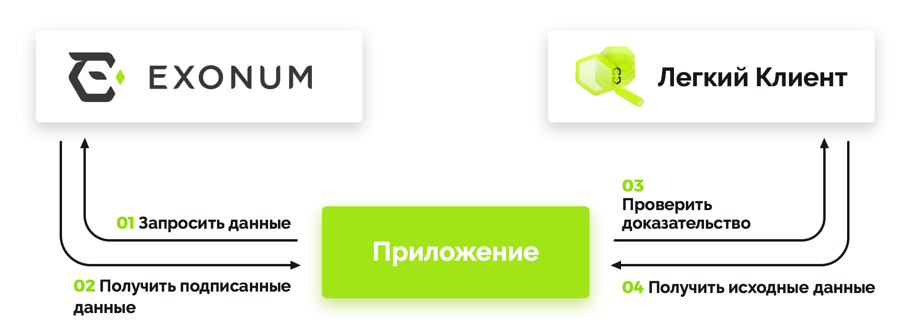
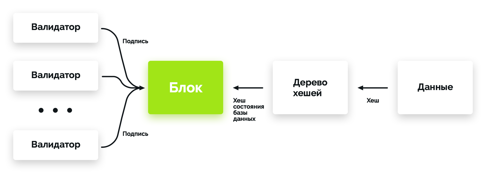

# Легкие клиенты

Чтобы система лучше поддавалась проверке, Exonum включает в себя
[**легкий клиент**](https://github.com/exonum/exonum-client). Легкий клиент &mdash;
это JavaScript библиотека с рядом вспомогательных функций, доступных для
использования фронтенд разработчиками. Эти вспомогательные функции используются
для проверки ответов от блокчейна на стороне клиента с использованием
криптографических доказательств.

Функции клиента делятся на следующие подмодули:

- **Данные**. Функции для
  [сериализации и десериализации данных](https://exonum.com/doc/architecture/serialization/)
  из формата JSON в двоичный формат Exonum
- **Криптография**. Функции для вычисления хешей, создания и проверки цифровых
  подписей
- **Доказательства**. Функции для проверки криптографических доказательств,
  возвращаемых блокчейном, такие, как функции проверки доказательств для индексов
  [Merkle][mt-index] и [Merkle Patricia][mpt-index]
- **Проверка целостности блокчейна**. Функция проверки достоверности блока
  (его соответствие [алгоритму консенсуса](consensus.md))

!!! note "Примечание"
    Хеш всего состояния блокчейна является частью каждого блока (см.
    [хранение данных](https://exonum.com/doc/architecture/storage/)).
    Этот хеш формируется с помощью индексов
    Merkle и Merkle Patricia. Таким образом, используя функции проверки
    доказательств, можно проверить наличие любых данных блокчейна в блоке.
    Сам блок можно проверить с помощью проверки целостности блокчейна.

Для легкого клиента существуют два типичных варианта использования:

- Формирование и отправка транзакций в сеть блокчейна Exonum
- Формирование [запросов](services.md) к полным узлам сети
  (обычно, HTTP GET запросы) и проверка ответов

## Создание транзакций

В этом и следующем разделе все функции, выделенные *курсивом*, являются
функциями, реализованными в легком клиенте Exonum.

1. При запуске фронтенд приложения (например, с помощью обработчика нажатия
   кнопки) создается новая транзакция. Данные транзакции хранятся в формате JSON.
   Затем данные *преобразуются в двоичный формат Exonum* и *подписываются цифровой
   подписью* с использованием библиотеки легкого клиента.
2. Фронтенд приложение получает цифровую подпись из библиотеки легкого клиента.
3. Сгенерированная транзакция (данные JSON + цифровая подпись) отправляется на
   полный узел по запросу HTTP POST.
4. Фронтенд приложение получает уведомление (например, хеш транзакции) в ответ
   на запрос HTTP POST.

!!! note "Примечание"
    Сериализация во время подписания является необходимым шагом, поскольку все
    данные (включая транзакции) хранятся в Exonum в
    [особом двоичном формате](https://exonum.com/doc/architecture/serialization/).
    Это делается по нескольким причинам:

    - Двоичный формат недвусмыслен, тогда как одни и те же данные могут иметь
      несколько представлений в JSON (что приведет к различным хешам логически
      одних и тех же данных)
    - Данные, хранящиеся в двоичном формате, занимают меньше места на диске
    - Доступ к полю в двоичном формате может быть реализован с помощью быстрой
      арифметики указателей; для такой же операции для данных в JSON потребуется
      несколько считываний

## Отправка запросов

1. Клиент формирует HTTP GET запрос и отправляет его на полный узел в сети
   блокчейна Exonum.
2. Узел формирует ответ на запрос и соответствующее криптографическое
   доказательство и отправляет его обратно клиенту.
   Криптографическое доказательство включает заголовок блока вместе с
   [сообщениями типа `Precommit`](consensus.md#precommit),
   которые подтверждают его достоверность, и один или несколько
   [путей Merkle](../glossary.md),
   которые связывают ответ с заголовком блока.
3. После получения ответа от блокчейна, клиент
   *проверяет структуру* и *проверяет криптографические доказательства*
   ответа.
   Процедура верификации включает *проверку того, является ли возвращаемый ответ
   устаревшим*.  Это проверяется путем вычисления медианы временных меток,
   записанных в сообщениях типа `Precommit`, и сравнения их с местным временем
   клиента. Если среднее время в сообщениях типа `Precommit` слишком далеко в
   прошлом, ответ считается устаревшим, а его проверка неудачной.
4. Результат проверок и данные, полученные от полного узла, отображаются в
   пользовательском интерфейсе.

!!! note "Примечание"
    В случае необходимости аутентификации пользователя (например, для
    управления доступом к данным) запросы могут быть *подписаны цифровой
    подписью*.

Пример криптографического доказательства:

На этом рисунке данные имеют
[сериализуемый](https://exonum.com/doc/architecture/serialization/)
тип, известный фронтенд приложению.
Они привязаны к [состоянию блокчейна](../glossary.md)
через одно или несколько [деревьев хешей](../glossary.md) или их варианты.
Хеш состояния блокчейна является частью блока, подписанного валидаторами блокчейна.

## Предпосылки

Блокчейн, как технология, расширяющая возможности распределенных баз данных,
подразумевает возможность аудита или проверки хранимой информации. Этот аудит
может быть выполнен несколькими способами.

В системе с полными узлами (узлами, которые хранят полную копию блокчейна),
аудит может выполняться автоматически во время работы таких узлов. Когда получен
новый блок, полный узел проверяет его соответствие алгоритму консенсуса и
правильность выполнения транзакций. Такой
**"аудит выделенными узлами аудиторами"** может быть эффективным, если он
выполняется внешними независимыми сторонами. Однако он имеет ряд недостатков:

- Чтобы выполнять аудит, нужна полная копия блокчейна и достаточные
  вычислительные ресурсы для синхронизации с валидаторами блокчейна
- Этот тип аудита должен быть постоянным, чтобы обеспечить правильность состояния
  системы
- Чтобы начать аудит, полный узел-аудитор должен дойти до текущей высоты
  блокчейна. Это может занять много времени, особенно если блокчейн имеет
  значительную пропускную способность транзакций
- **Конечный пользователь системы вынужден доверять паре «валидаторы» +
  «аудиторы»**, так как у него нет возможности проверить правильность данных
  блокчейна. По сути, с точки зрения пользователя, такой блокчейн ничем не
  отличается от распределенной базы данных.

Одним из способов устранения недостатков "аудита выделенными узлами аудиторами"
является внедрение *легких клиентов*, также известных как *тонкие клиенты* или
просто *клиенты*. В Биткоин блокчейне, эти клиенты также известны как клиенты
[SPV (simple payment verification)](https://en.bitcoin.it/wiki/Thin_Client_Security).
Легкие клиенты &mdash; это программы, способные копировать и проверять
небольшую часть информации, хранящейся в блокчейне. Обычно клиенты проверяют
информацию, относящуюся к конкретному пользователю (например, историю его
транзакций). Эта проверка возможна благодаря использованию специфических
контейнеров данных в блокчейне: индексов [Merkle][mt-index]
и [Merkle Patricia][mpt-index].

Преимуществами этого подхода являются:

- **Снижение необходимости доверия третьим сторонам**: проверка всех данных,
  возвращаемых блокчейном в ответ на запросы, выполняется самим пользователем
  на его машине
- Постоянный (хотя и частичный) аудит системы возможен без необходимости
  использования вычислительных ресурсов, сопоставимых с ресурсами валидаторов с точки
  зрения производительности. Проверяются только релевантные данные
- Чтобы начать или возобновить аудит системы, не требуется время на синхронизацию

!!! note "Примечание"
    Пользователю все еще нужно доверять разработчикам легкого клиента, если
    клиент имеет закрытый исходный код. Если же исходный код открыт, пользователь
    должен выполнить аудит кода легкого клиента, чтобы полностью исключить
    необходимость доверия третьим сторонам.

Наличие легких клиентов не означает отсутствие узлов-аудиторов, поскольку их
задачи различны. Легкие клиенты проверяют данные конкретного пользователя, в
то время как узлы-аудиторы проверяют блокчейн в целом.

Безопасность легких клиентов сравнима с проверками безопасности [TLS][wiki:tls],
встроенными в веб-браузеры. Это не является прямой заменой аудиту, выполняемому
узлами-аудиторами, но обеспечивает измеримую степень защиты от
[атак посредников][wiki:mitm] и злонамеренно действующих узлов, с которыми может
взаимодействовать клиент. В то же время, если легкие клиенты охватывают все
транзакции блокчейна, их *коллективная* безопасность может стать сопоставимой с
безопасностью, предоставляемой узлами-аудиторами.

Наличие легких клиентов в блокчейн системе приводит к определенным трудностям в
процессе разработки:

- Бэкэнд разработчики должны быть в согласии с разработчиками клиентов в
  вопросах API запросов и форматов криптографических доказательств (фактически,
  модели данных блокчейна)
- Любые изменения в модели данных блокчейна должны сопровождаться
  соответствующими изменениями в логике проверки доказательств, выполняемой
  легкими клиентами
- Поскольку легкий клиент существенно расширяет доступ к Exonum REST конечным
  точкам с криптографией, может возникнуть необходимость создать несколько
  легких клиентов и постоянно поддерживать базу их кода

!!! note "Примечание"
    Первые две проблемы, описанные выше, могут быть решены с помощью схемы
    данных, записанной в формате, независимом от языка (см.
    [дорожную карту Exonum](https://exonum.com/doc/roadmap/)).

Несмотря на сложность разработки, **присутствие легких клиентов в блокчейн
системе является единственным практичным способом позволяющим в значительной степени
избавиться от необходимости доверять третьим сторонам**.

[wiki:tls]: https://en.wikipedia.org/wiki/Transport_Layer_Security
[wiki:mitm]: https://en.wikipedia.org/wiki/Man-in-the-middle_attack
[mt-index]: https://exonum.com/doc/architecture/storage#prooflistindex
[mpt-index]: https://exonum.com/doc/architecture/storage#proofmapindex
